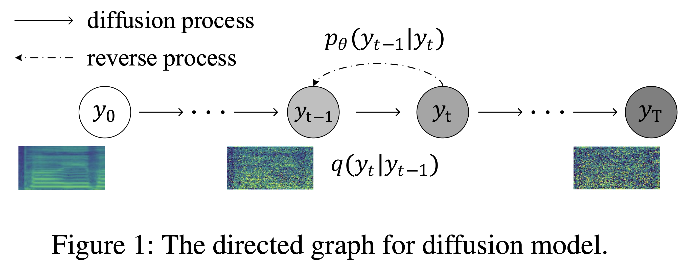
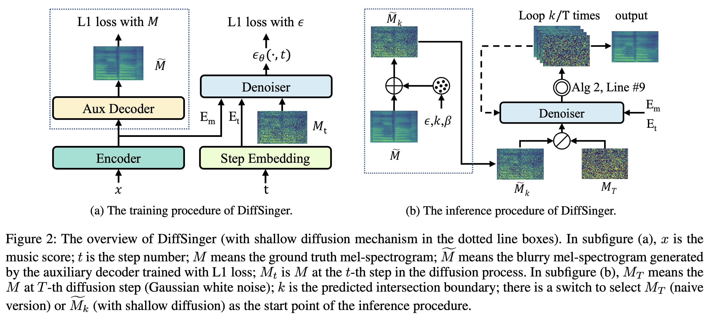
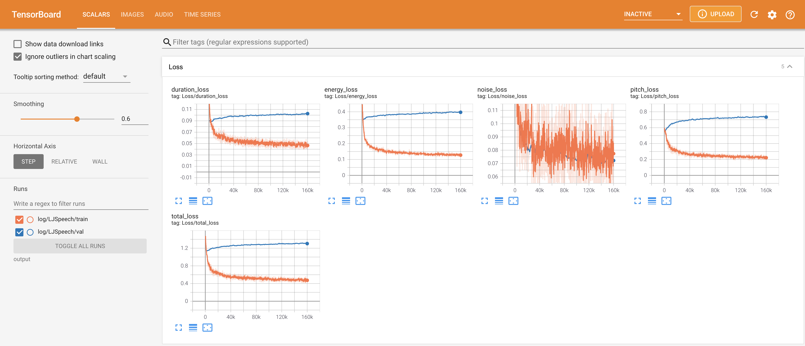
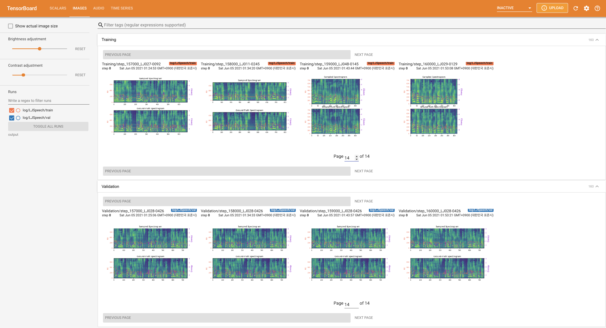
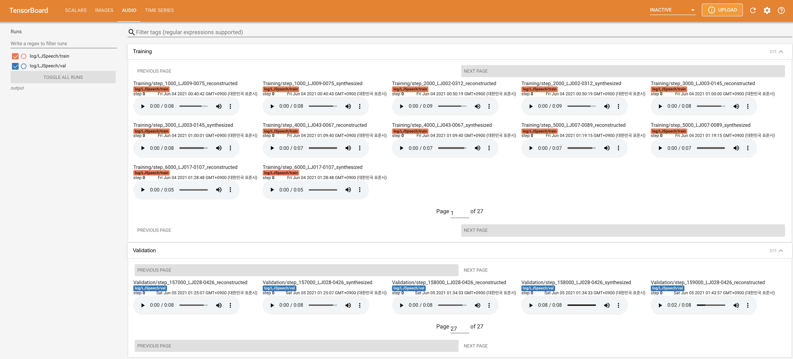

# DiffSinger - PyTorch Implementation

PyTorch implementation of [DiffSinger: Singing Voice Synthesis via Shallow Diffusion Mechanism](https://arxiv.org/abs/2105.02446) (focused on DiffSpeech).

<p align="center">
    
</p>

<p align="center">
    
</p>

# Repository Status
- [x] Naive Version of DiffSpeech (not DiffSinger)
- [x] Auxiliary Decoder (from FastSpeech2)
- [x] An Easier Trick for Boundary Prediction of `K`
- [x] Shallow Version of DiffSpeech (Shallow Diffusion Mechanism): Leveraging pre-trained auxiliary decoder + Training denoiser using `K` as a maximum time step
- [ ] Multi-Speaker Training

# Quickstart

***DATASET*** refers to the names of datasets such as `LJSpeech` in the following documents.

***MODEL*** refers to the types of model (choose from '**naive**', '**aux**', '**shallow**').

## Dependencies
You can install the Python dependencies with
```
pip3 install -r requirements.txt
```

## Inference

You have to download the [pretrained models](https://drive.google.com/drive/folders/1BBuaoSlInwFoUt1PKLxo0Sjl5qWCq945?usp=sharing) and put them in 
- ``output/ckpt/LJSpeech_naive/`` for '**naive**' model.
- ``output/ckpt/LJSpeech_shallow/`` for '**shallow**' model. Please note that the checkpoint of the '**shallow**' model contains both '**shallow**' and '**aux**' models, and these two models will share all directories except results throughout the whole process.

For English single-speaker TTS, run
```
python3 synthesize.py --text "YOUR_DESIRED_TEXT" --model MODEL --restore_step RESTORE_STEP --mode single --dataset DATASET
```
The generated utterances will be put in ``output/result/``.


## Batch Inference
Batch inference is also supported, try

```
python3 synthesize.py --source preprocessed_data/LJSpeech/val.txt --model MODEL --restore_step RESTORE_STEP --mode batch --dataset DATASET
```
to synthesize all utterances in ``preprocessed_data/LJSpeech/val.txt``.


## Controllability
The pitch/volume/speaking rate of the synthesized utterances can be controlled by specifying the desired pitch/energy/duration ratios.
For example, one can increase the speaking rate by 20 % and decrease the volume by 20 % by

```
python3 synthesize.py --text "YOUR_DESIRED_TEXT" --model MODEL --restore_step RESTORE_STEP --mode single --dataset DATASET --duration_control 0.8 --energy_control 0.8
```

Please note that the controllability is originated from [FastSpeech2](https://arxiv.org/abs/2006.04558) and not a vital interest of DiffSpeech.

# Training

## Datasets

The supported datasets are

- [LJSpeech](https://keithito.com/LJ-Speech-Dataset/): a single-speaker English dataset consists of 13100 short audio clips of a female speaker reading passages from 7 non-fiction books, approximately 24 hours in total.

## Preprocessing
 
First, run 
```
python3 prepare_align.py --dataset DATASET
```
for some preparations.

For the forced alignment, [Montreal Forced Aligner](https://montreal-forced-aligner.readthedocs.io/en/latest/) (MFA) is used to obtain the alignments between the utterances and the phoneme sequences.
  Pre-extracted alignments for the datasets are provided [here](https://drive.google.com/drive/folders/1fizpyOiQ1lG2UDaMlXnT3Ll4_j6Xwg7K?usp=sharing). 
  You have to unzip the files in `preprocessed_data/DATASET/TextGrid/`. Alternately, you can [run the aligner by yourself](https://montreal-forced-aligner.readthedocs.io/en/latest/user_guide/workflows/index.html).

  After that, run the preprocessing script by
  ```
  python3 preprocess.py --dataset DATASET
  ```

## Training

You can train three types of model: '**naive**', '**aux**', and '**shallow**'.

- Training Naive Version ('**naive**'):

    Train the naive version with
    ```
    python3 train.py --model naive --dataset DATASET
    ```

- Training Auxiliary Decoder for Shallow Version ('**aux**'):

    To train the shallow version, we need a pre-trained FastSpeech2. The below command will let you train the FastSpeech2 modules, including Auxiliary Decoder.
    ```
    python3 train.py --model aux --dataset DATASET
    ```

- An Easier Trick for Boundary Prediction:

    To get the boundary `K` from our validation dataset, you can run the boundary predictor using pre-trained auxiliary FastSpeech2 by the following command.
    ```
    python3 boundary_predictor.py --restore_step RESTORE_STEP --dataset DATASET
    ```
    It will print out the predicted value (say, `K_STEP`) in the command log.
    
    Then, set the config with the predicted value as follows
    ```yaml
    # In the model.yaml
    denoiser:
        K_step: K_STEP
    ```
    Please note that this is based on the trick introduced in Appendix B.

- Training Shallow Version ('**shallow**'):

    To leverage pre-trained FastSpeech2, including Auxiliary Decoder, you must set `restore_step` with the final step of auxiliary FastSpeech2 training as the following command.
    ```
    python3 train.py --model shallow --restore_step RESTORE_STEP --dataset DATASET
    ```
    For example, if the last checkpoint is saved at 160000 steps during the auxiliary training, you have to set `restore_step` with `160000`. Then it will load the aux model and then continue the training under a shallow training mechanism.

# TensorBoard

Use
```
tensorboard --logdir output/log/LJSpeech
```

to serve TensorBoard on your localhost.
The loss curves, synthesized mel-spectrograms, and audios are shown.

<!-- 

 -->

# Notes

1. (Naive version of DiffSpeech) The number of learnable parameters is `27.767M`, which is similar to the original paper (`27.722M`).
2. Use **HiFi-GAN** instead of **Parallel WaveGAN (PWG)** for vocoding.

# Citation

```
@misc{lee2021diffsinger,
  author = {Lee, Keon},
  title = {DiffSinger},
  year = {2021},
  publisher = {GitHub},
  journal = {GitHub repository},
  howpublished = {\url{https://github.com/keonlee9420/DiffSinger}}
}
```

# References
- [MoonInTheRiver's DiffSinger](https://github.com/MoonInTheRiver/DiffSinger) (Authors' codebase)
- [ming024's FastSpeech2](https://github.com/ming024/FastSpeech2) (Later than 2021.02.26 ver.)
- [hojonathanho's diffusion](https://github.com/hojonathanho/diffusion)
- [lmnt-com's diffwave](https://github.com/lmnt-com/diffwave)
